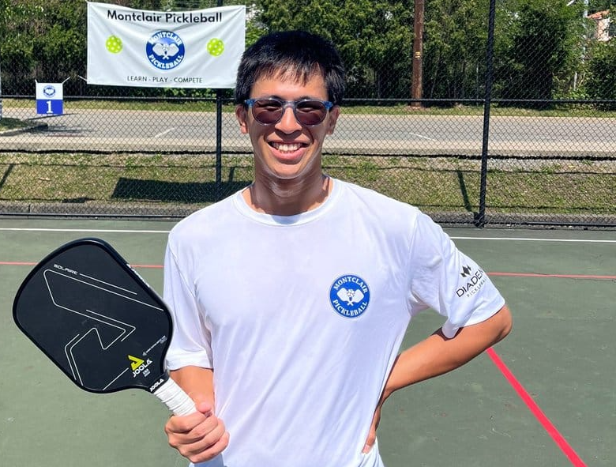

<style>
.title{
display: none;
}
</style>

```{css, echo=FALSE}

.contact-box {
position: relative;
border: 2px solid lightgrey;
padding: 20px;
margin-bottom: 20px;
border-radius: 10px;
background-color: #f9f9f9;
display: block;
width: 100%;
}

.contact-text h2 {
margin-bottom: 10px;
font-size: 1.3em;
margin-right: 50px;
font-weight: bold;
}

.contact-wrapper {
display: flex;
}

.contact-text {
flex-grow: 1;
}

.year {
position: absolute;
top: 10px;
right: 10px;
font-weight: bold;
padding-left: 10px; /* Add left padding to separate the year from the text */
}

.center {
margin-bottom: 20px;           /* This adds some space below the image */
}


h2 {
margin-bottom: 10px;
font-size: 1.3em;
margin-right: 50px; /* Add right margin to separate the title from the year */
}

p {
margin-bottom: 1em; /* 1em is equal to the current font size */
line-height: 1.6;
}

.about-us-section {
background-color: #f9f9f9;  /* This adds a background color to the section */
padding: 20px;              /* This adds some padding around the text */
border-radius: 10px;        /* This makes the corners of the section rounded */
margin-top: 20px;           /* This adds some space above the section */
margin-bottom: 20px;        /* This adds some space below the section */
font-family: Arial, sans-serif; /* This changes the font of the text */
}


.about-us-section h2 {
color: #333;  /* This changes the color of the heading */
font-size: 1.5em;  /* This changes the size of the heading */
}

.about-us-section p {
line-height: 1.6;  /* This changes the space between lines of text */
}

```

<div class="center">

</div>

<div class="about-us-section">
<h2>About Scott</h2>
<p>
Scott (28 M) was born in Edison, NJ, raised in Piscataway, NJ, by two loving Taiwanese immigrants seeking a better future of opportunities for their four sons, and he’s the youngest. Scott played ping pong until middle school and attended Piscataway High School. He self-taught himself tennis with a Japanese Comic/Animation, was cut from varsity tennis freshman year, persisted and joined sophomore year doubles 1, and was the voted co-captain for junior and senior year where he played and coached doubles for two years. One of his boardgame friends introduced him to pickleball winter of 2021 and from spring 2022 the universe of pickleball engulfed him.
</p>

<p>
He loves to play and excel at games. Scott is an ambitious 4.5-5.0+ pickleball tournament player who’s sole focus is to grow pickleball enough for it to be in the 2028 Los Angeles, California Olympics and compete in it. Scott’s history with disciplines ranges from 8 years of violin and ping pong, 3 years of running short and long distances for track and cross country, competitive strategy and card games, 10 years of competitive E-Sports, a wide variety of coaching experiences, and practicing philosophy daily. His competitive history in sports and love of learning games propels him to consistently evolve pickleball.
</p>

<p>
Scott’s coaching style focuses on making the process of learning pickleball engaging, fun, and leaving with a constant sense of progress and accomplishment. No matter what level the player is, Scott will personally cater the coaching style to fit the needs of the individual. Showing up and deliberately exercising is enough accomplishment for a healthy body, mind, soul.
</p>

<p>
His passion and ambition for pickleball has driven him to transition away from his full-time job as an Executive Assistant to part-time, and transitioning slowly to full-time pickleball coaching, content, personal branding, and tournament touring. He graduated with and Associates of Science in Business Administrations from Middlesex College winter of 2022 and will be attending Rutgers Business School fall of 2023. Scott aims to debut as a pro in 2024 and play professional pickleball nationally/internationally for many years to come.
</p>
</div>